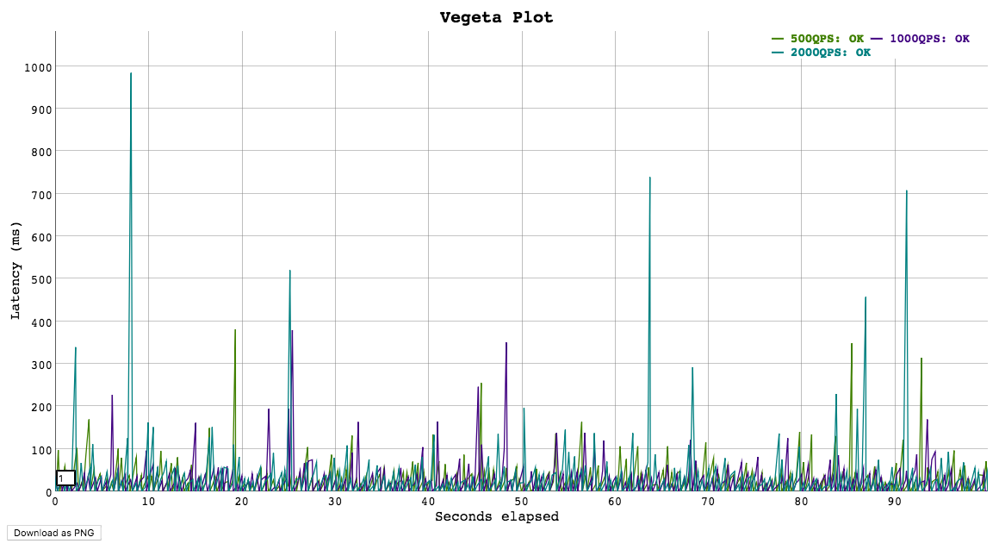

buu
===

buu is a wrapper around vegeta for load testing sagemaker endpoints.

Installation
------------

N.B : buu requires an active installation of `vegeta`_.

To install buu:, run :

.. code:: bash

   pip install buu

Usage
-----

1. Prepare a yaml file of your sagemaker and vegeta configuration.
2. Run ``buu --config=[path_to_your_config.yaml]``

Configuration keys
------------------
verbose : Flag to log to stdout

sagemaker:
    endpoint_name: The name of your endpoint
    content_type: The endpoint content type. Currently supports only application/json and text/csv
    data_path: The path to your test data
    region: AWS region

vegeta:
    name: The name of the current vegeta test
    duration: The duration of the load test
    format: html | bin : If html, buu plots the load test result in an html file. If bin, it logs the results to stdout
    rate: The number of requests to make open: bool : If 1, opens the plot in chrome.

Sample HTML report
------------------

   Report

.. _vegeta: https://github.com/tsenart/vegeta